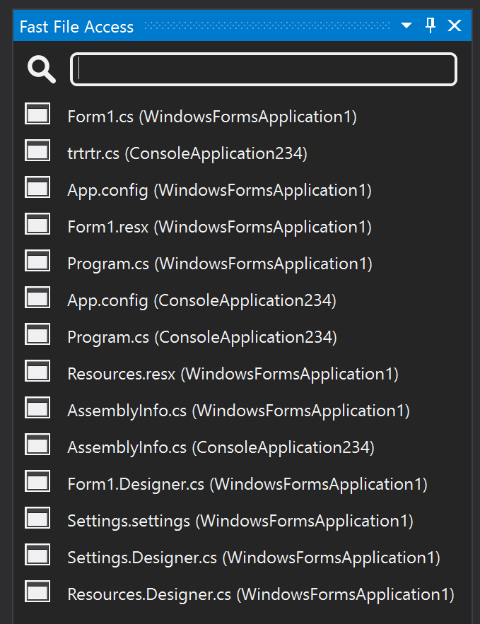
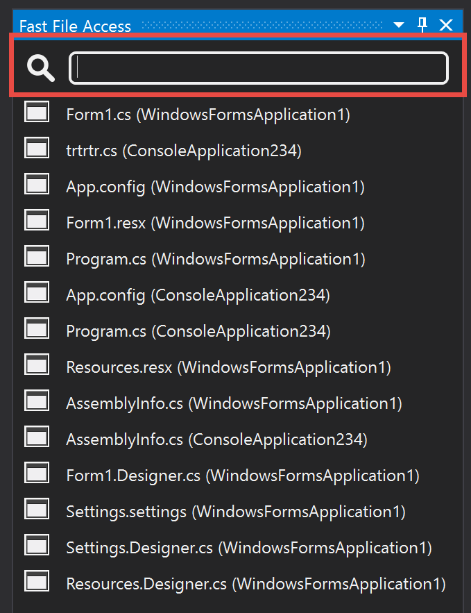
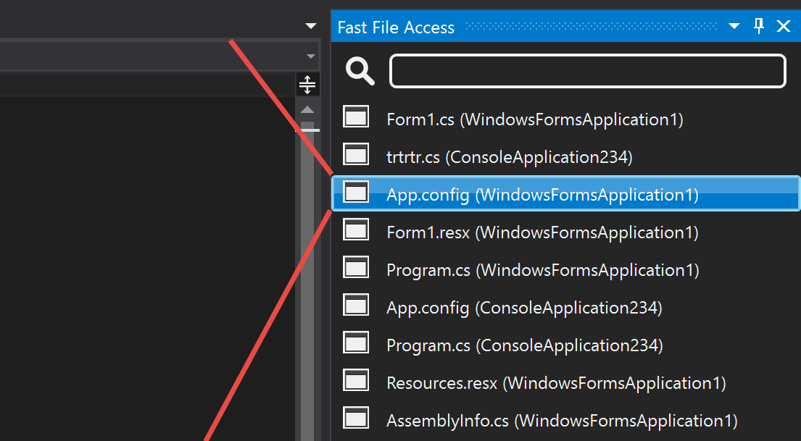
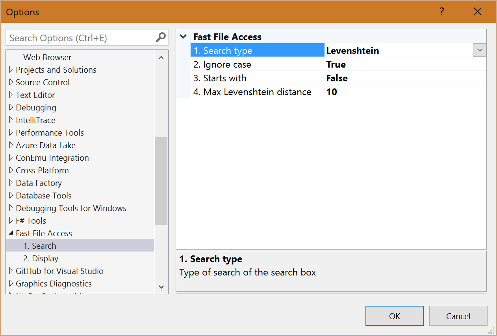
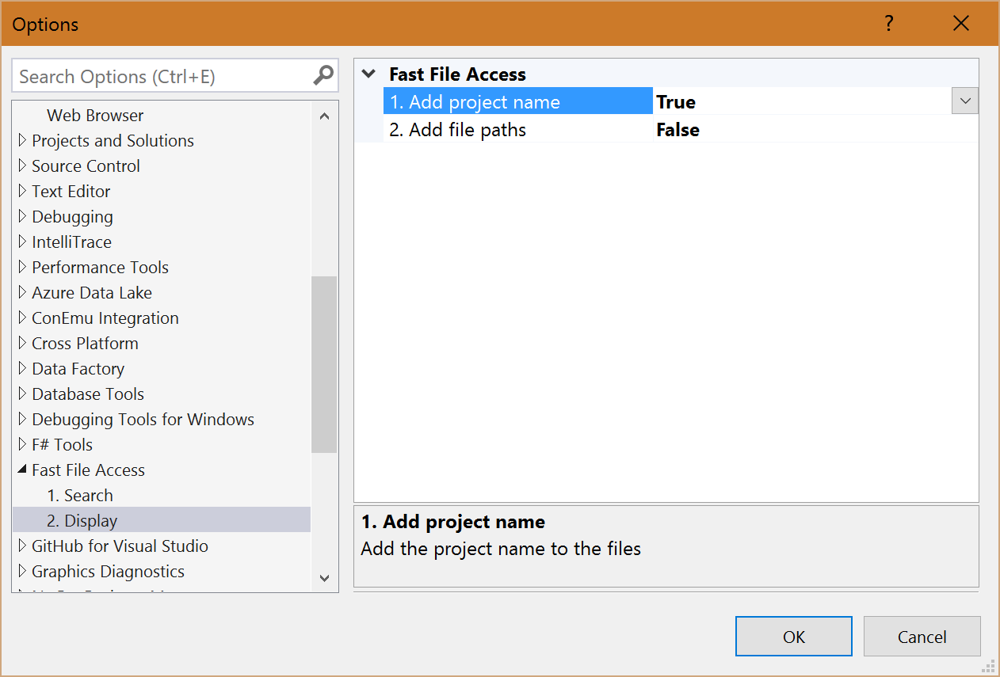

# FastFileAccessExtension

Download this extension from the [VS Gallery](https://visualstudiogallery.msdn.microsoft.com/[GuidFromGallery])

---------------------------------------

Fast access files within big projects or solution.

Search in big solutions with several project and files for one specific file can be annoying.
To make this easier I wrote this extension. With this extension you can search with several 
types of searches within all files which are part of the loaded soltion and projects.
  
The extension can be used with the keyboard. With the keys Ctrl+R,D you can open the search
and start typing. With the Up and Down keys you can change from the search box to the listview.
  
Keybinding: 
- Open search: Ctrl+R,D 
- Change focus from search to listview: Up or Down key 
- Open selected file: Return Key 
 
Current search or string matching types: 
- Contain string 
- Regex matching 
- Levenshtein distance 
- Word base levenshtein distance

See the [changelog](CHANGELOG.md) for changes and roadmap.

## Features

- [x] Show a window which contains all the files from Solution Explorer
- [x] Add search to the file window
- [x] Open file from choose one in the window
- [x] Search type setting
- [x] Display setting

### Show a window which contains all the files from Solution Explorer
 

### Add search to the file window
 

### Open file from choose one in the window
 

### Search type setting
 

### Display setting
 

## Contribute
Check out the [contribution guidelines](CONTRIBUTING.md)
if you want to contribute to this project.

## License
[Apache 2.0](LICENSE)